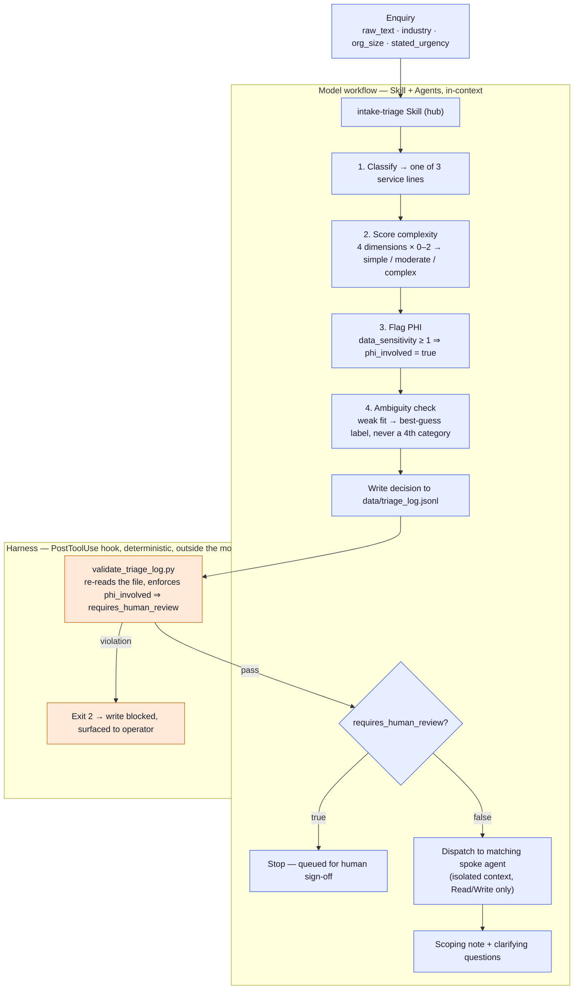
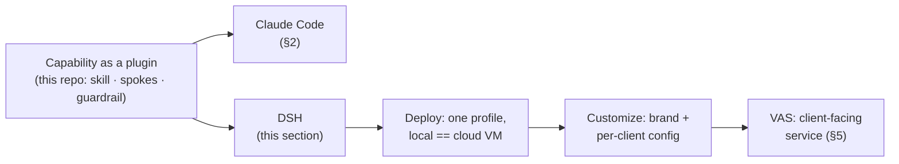
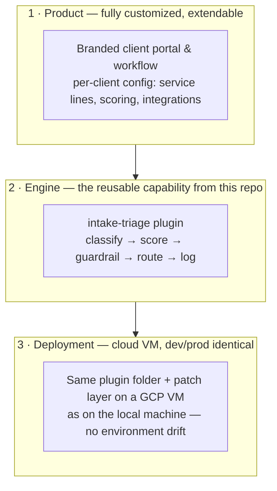
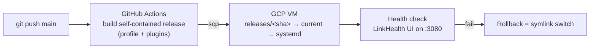

# LinkHealth Intake Triage

[](https://github.com/fmlin0429712024/linkhealth-triage/actions/workflows/deploy.yml)

An automated triage system for inbound business enquiries at a healthcare-sector AI
consultancy. Given a free-text enquiry plus industry, org size, and stated urgency, it
classifies the enquiry by service line, scores its complexity, flags PHI/compliance
exposure, and routes it to the right next step — with a hard stop for human review
whenever patient data is in play.

Built from Claude Code primitives: a Skill, three Agents, and a hook. No separate app
or framework. (An optional DeepSeek Harness packaging PoC is described in §4.)

## 1. Architecture

### What it does



Two different planes, drawn deliberately: the blue nodes are the Skill/Agents reasoning
in-context — they can be wrong or forget an instruction. The orange node is a plain
Python script the Claude Code **harness** runs after every `Write`, entirely outside the
model's context — it doesn't trust the model, it re-reads the file and checks the rule
itself. See "The guardrail is enforced twice, on purpose" below.

**The one hard stop:** any enquiry touching clinical/patient-identifiable data
(`phi_involved: true`) always requires human review and is never auto-dispatched,
regardless of how "simple" it otherwise scores. Everything else can run end-to-end
without a human in the loop.

### Why hub-and-spoke, and why isolated spokes

- **Untrusted input** — `raw_text` comes from a public web form; it's a real
  prompt-injection surface. Tool-restricted (`Read`/`Write` only), isolated spoke
  agents bound the blast radius of anything embedded in an enquiry.
- **Batch processing, no cross-contamination** — enquiries get processed in batches. A
  shared-context design would accumulate every prior enquiry (including PHI) into one
  growing thread. Isolated spokes prevent that by construction.
- **Previews the production shape** — a webhook-triggered, per-submission job is a
  stateless hub (dispatcher) calling a stateless worker (spoke). Building it that way
  now avoids a rewrite later.

No message queue at current volume (~40–60/week, single operator) — the append-only log
already gives durability, since a decision is persisted before the spoke step runs. See
`docs/PRD.md` §7 for the specific triggers that would change this call.

### The guardrail is enforced twice, on purpose

The rule (`phi_involved: true` ⇒ `requires_human_review: true`, no auto-dispatch) is
stated once as a model instruction (`SKILL.md` Step 3) and enforced a second time in
code, independent of whether the model follows the instruction: a `PostToolUse` hook
fires on every write to the triage log, re-reads the file itself, and blocks (non-zero
exit, clear stderr) if a record violates the rule or is missing required fields. The
instruction can't be trusted alone; the hook doesn't depend on the model remembering
anything.

### Repository layout

```
.claude/
  skills/intake-triage/SKILL.md   the hub: classification + scoring rubric + routing rules
  agents/*.md                     the three spokes (automation-lead, data-lead, deployment-lead)
  hooks/validate_triage_log.py    deterministic guardrail backstop
  settings.json                   wires the hook to the Write tool
data/
  synthetic_enquiries.jsonl       12 hand-built test cases with expected_* labels
  triage_log.jsonl                append-only output of real triage runs
  eval_harness.py                 runs all 12 cases through the skill, grades the output
  test_guardrail_hook.py          isolated test suite for the hook (no model calls needed)
docs/
  PRD.md                          full spec: requirements, data flow, scope boundaries
  TASKS.md                        spec-driven task breakdown, done/open status
.claude-plugin/marketplace.json   repo-root marketplace listing (points at triage-claude-plugin/)
triage-claude-plugin/             self-contained Claude Code plugin packaging of the same system
  (portable copy of the skill, agents, hook, and demo cases — see its own README)
triage-dsh-plugin/                optional extended PoC — self-contained DeepSeek Harness (DSH)
  plugin packaging of the same system (bundle manifest + patch, the same skill and spokes,
  a JS guardrail backstop wired to DSH's tools/post-execute, and the parity Python script
  — see its own README; not part of the core deliverable)
```

## 2. Running and validating it

### Installing the plugin

The repo root doubles as a plugin marketplace (`.claude-plugin/marketplace.json`), which
lists `triage-claude-plugin/` as a plugin by relative path — no separate repo needed.

**Claude Code (CLI):**

```
/plugin marketplace add fmlin0429712024/linkhealth-triage
/plugin install linkhealth-intake-triage
```

**Claude Cowork:** plugins install through the UI, not slash commands — open
**Customize → Plugins → Add marketplace**, paste
`https://github.com/fmlin0429712024/linkhealth-triage`, then install
`linkhealth-intake-triage` from the results.

Then try it on a bundled sample, e.g.: *"run intake-triage on case E005 in
triage-claude-plugin/examples/synthetic_enquiries.jsonl."*

### Validated in Claude Cowork

Beyond the synthetic eval harness, the packaged plugin was installed in Claude Cowork and
run live against two bundled cases:

- **E005** (AGV waste transport, hemodialysis center) — Onsite Automation & Robotics
  Deployment, moderate (total=4), `phi_involved: false`, auto-routed to `deployment-lead`,
  which drafted a scoping note and flagged an onsite walkthrough as a prerequisite.
- **E002** (prior-authorization automation, 450-bed hospital network) — Process &
  Workflow Automation, complex (total=6), `phi_involved: true` → `requires_human_review:
  true`, correctly stopped before any spoke dispatch.

Both matched their `expected_*` labels exactly. Two things this pass surfaced that a
synthetic eval alone wouldn't have caught:

- **A packaging bug**: `.claude-plugin/marketplace.json` initially listed only `plugins`,
  missing the required top-level `name` and `owner` fields — Cowork's "Add marketplace"
  rejected it until those were added. Worth checking if you fork this and rename things.
- **A design decision that paid off**: Cowork installs a plugin read-only and redirects
  `Write` calls to a per-task working folder outside the plugin directory. The guardrail
  hook (`scripts/validate_triage_log.py`) reads the actual written-to path from its own
  stdin payload rather than deriving it from its file location on disk — see "The
  guardrail is enforced twice, on purpose" above — which is exactly why it kept working
  once the log path moved somewhere the hook's source location never anticipated.

One operational implication for the guardrail-tripped case specifically: since sign-off
review should happen against the durable record, not a chat transcript, a reviewer should
open the actual `triage_log.jsonl` in Cowork's working folder for a queued case rather
than trusting the conversational summary — that's the whole point of logging it.

### Running the tests

```bash
# Hook logic, offline, no model calls
python3 data/test_guardrail_hook.py

# Full pipeline: feeds all 12 synthetic cases through headless Claude Code,
# grades classification/complexity/guardrail output against expected labels.
# Requires the `claude` CLI on PATH and network access.
python3 data/eval_harness.py
```

Both the hook's own test suite and a live run through the Skill (classify → log → hook
validate → dispatch to a spoke) have been exercised against real cases, including one
that trips the PHI guardrail and correctly halts before dispatch.

## 3. Production considerations

### Scope boundaries (deliberate, not gaps)

This system triages **business enquiries about services** — it does not triage
patients and is never repurposed for clinical decision support. Also deliberately not
built this round: a web front-end for the intake form (synthetic JSONL stands in for
submissions), an internal review dashboard (the log file is sufficient at this volume),
and a message queue (see the trigger table in `docs/PRD.md` §7 for when that changes).

### What I'd change with more scale or time

- Replace the synchronous Agent-tool dispatch with a real queue once volume or
  multi-lead claiming requires it (trigger table in `docs/PRD.md` §7).
- Add a lightweight review dashboard once the log file stops being a sufficient
  read surface for the operator.
- The PHI rubric intentionally treats plain scheduling metadata (a name + an
  appointment time) as not triggering the guardrail, reserving it for clinical
  content. That's a defensible but debatable line — worth revisiting against actual
  legal/compliance guidance rather than a judgment call made while building this.

## 4. PoC — Deploying through DSH: two profiles, one product line

The core deliverable is the Claude Code plugin (Sections 1–3). This section is a
**PoC that turns the same capability into a deployable service** — the journey this
repo is on:



The DSH plugin (`triage-dsh-plugin/`) is the same system packaged for DeepSeek
Harness — a personal deployment, not a distribution package: the `intake-triage`
hub skill, the three spoke role prompts, the `validate-triage-log` tool, and a
`tools/post-execute` guardrail backstop (the DSH analogue of the Claude hook).
**Verified live**: classify → log → guardrail block → remediation, including a
PHI case correctly queued for human review.

### The real insight: profiles are applications

One DSH installation runs many profiles (`~/.dsh/profiles/<name>/`), each an
independent plugin composition — the same install, different products. This
product line runs as two:

| Profile | Role | Composes | Start |
|---|---|---|---|
| `web` | **DSH Dev** — clean workbench | stock UI only (no LinkHealth plugins) | `dsh web` → http://127.0.0.1:3080 |
| `linkhealth` | **LinkHealth VAS** — the product | triage + brand front door (`linkhealth-gui-plugin`) | `dsh --profile linkhealth --port 3081` → http://127.0.0.1:3081 |

Plugins are **shared assets referenced by profiles, never copied**: `web` stays
clean for development, `linkhealth` composes the product. Adding a capability
means adding its plugin to the `linkhealth` profile — never to `web`. Because
deployment is config-as-code (the profile is the deployment unit), the same
`linkhealth` files that run locally are the ones deployed to a cloud VM.

The front door (`linkhealth-gui-plugin/`) brands the product surface — deep-teal
theme, a capability launcher in the sidebar, a capabilities showcase in Settings
— all additive, no default component replaced. See `linkhealth-gui-plugin/README.md`
and `triage-dsh-plugin/README.md` for the layouts and the Claude Code ↔ DSH
mapping.

## 5. Commercialize — from MVP to client service (VAS)

*Partially built — stage 0 is DONE and live: the system runs on a GCP VM via
CI/CD (see below and `docs/deployment-gcp.md`). Stages 1–2 are the roadmap
ahead.*

**VAS (Value-Added Service)** — an AI-driven service layer on top of a client's
existing operations: specialized, constrained, auditable, and therefore safe for
healthcare data (no open-ended general agents touching client data).



**Stage 0 in production — CI/CD pipeline:**



1. **Product — fully customized, extendable.** The client-facing surface is
   configured per customer (branding, service lines, scoring, integrations); the
   capability underneath is the same packaged plugin, so growing one client's
   needs never forks the core.
2. **Engine — this repo.** The triage capability stays a packaged plugin (Claude
   Code and DSH); the core is rewritten zero times across clients and runtimes.
3. **Deployment — cloud VM, dev/prod consistent.** Development happens locally
   with the exact same plugin folder, patch layer, and guardrail that runs on
   the VM — the profile is the deployment unit, so "works on my machine" is the
   same artifact that runs in production.

### Roadmap (in execution)

| Stage | What | Status |
|---|---|---|
| 0 | GCP VM + CI/CD engine (private access, SSH tunnel) | ✅ **DONE — live** (`docs/deployment-gcp.md`) |
| 1 | First client: intake → triage → human review → delivery | ⏳ next |
| 2 | Productize: client portal, auth, multi-tenant, billing | ⏳ later |

VAS is a working name; the standard positioning is *agent-powered vertical
service* (the AaaS family).

## 6. Testing

| Layer | What | Where |
|---|---|---|
| Unit | 22 `node:test` cases (zero deps) — guardrail + launcher logic | `node --test` |
| Demo | 3 ready-to-paste prompts: full flow / guardrail trip / hard block | `examples/demo-prompts.md` |
| Production | live verification on the GCP VM (classify → guardrail → block → spoke) | `docs/testing.md` |

Full testing doc, known boundaries, and the production checklist:
[`docs/testing.md`](docs/testing.md).

## 7. Docs

| Doc | What it covers |
|---|---|
| [`docs/PRD.md`](docs/PRD.md) | the triage system spec-as-built (core) |
| [`docs/PRD-gui-plugin.md`](docs/PRD-gui-plugin.md) | the front-door plugin spec |
| [`docs/deployment-gcp.md`](docs/deployment-gcp.md) | GCP deploy + CI/CD + tunnel access + rollback |
| [`docs/testing.md`](docs/testing.md) | unit / demo / production verification |
| [`examples/demo-prompts.md`](examples/demo-prompts.md) | three ready-to-paste demo prompts |
